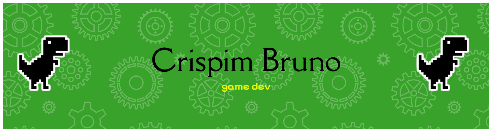

"/>

-----

<table>
<tr>
 <td align="center" colspan="11"></td>
</tr> 
<tr>
<!--<td>-->
<td>
</td>
<td>
</td>
<td>
</td>
<td>
</td>
<td>
</td>
<td>
</td>
<td>
</td>
<!--<td>
</td>-->
<td>
</td>
<td>
</td>
<td>
</td>
<td>
</td>
</tr>
<tr>
 <td align="center" colspan="11"></td>
</tr> 
</table>

-----

<table>
<tr>
<td align="center">:octocat: <a href="https://www.githubwrapped.io/crispimbruno" target="_blank">GitHub Wrapped</a></td>
<td align="center" colspan="2">:watch: <a href="https://wakatime.com/@aramuni">WakaTime</a></td>
</tr> 
<tr>
<td></td>
<td></td>
<td>

</td>
</tr>
</table>
